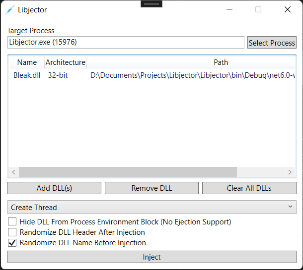

<h1 align="center">WxInjector</h1>

This program injects DLLs into any processes with three special methods and special flags. This program is useful for hackers, developers and cheaters alike. This injector is powered by [Bleak](https://github.com/Akaion/Bleak), which is by now deprecated but it still works without any flaws!

**Features**

* Supports WoW64 and x64 injection
* Supports ejection from process
* Has a variety of injection methods
* Has a variety of injection flags
* Has a metro interface and it is well-designed (based on my opinion)
* Can see if process or DLL is 64-bit or 32-bit
* Created entirely in .NET

**Injection Methods**

* CreateThread
* HijackThread
* ManualMap

**Injection Flags**

* HideDllFromPeb
* RandomizeDllHeaders (No Ejection Support)
* RandomizeDllName

## Screenshots

