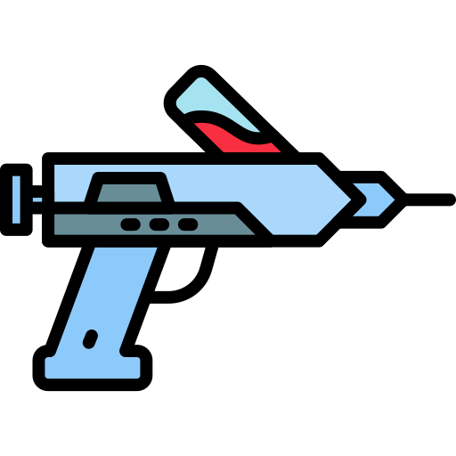

<h1>
    
    Libjector
</h1>

A simple and easy-to-use DLL injector!

## ⚙️ Features

> **Note**: Most of this feature set has been made possible with [Bleak](https://nuget.org/packages/Bleak) and [Lunar](https://github.com/jdewera/lunar)!

- [x] Supports WoW64 and x64 injection
- [x] Supports multiple injection methods
  - [x] Create Thread: Creates a new thread in the process and uses it to load a DLL
  - [x] Hijack Thread: Hijacks an existing thread in the process and forces it to load a DLL
  - [x] Manual Map: Manually emulates part of the Windows loader to map the DLL into the process
  - [x] Map Library (Lunar): An alternative injection method; maps DLL directly into memory
- [x] Supports injection and mapping flags
  - [x] Hide DLL from [Process Environment Block](https://wikipedia.org/wiki/Process_Environment_Block)
  - [x] Randomize DLL headers
  - [x] Randomize DLL name
  - [x] Discard headers (Lunar)
  - [x] Skip initialization routines (Lunar)
- [x] Simplistic user interface for easy use (with [Adonis UI](https://github.com/benruehl/adonis-ui))
- [x] Able to determine the architecture of a process or a DLL

## 💖 Credits

- Icon by [okta](https://flaticon.com/free-icon/injection_12115133)

## 📜 License

Distributed under the MIT License. See [LICENSE](./LICENSE) for more information.