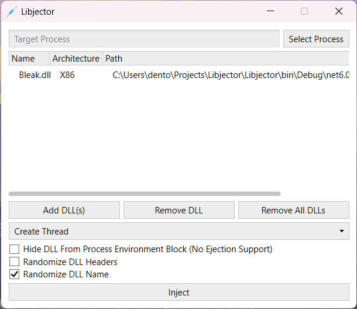

#  Libjector

A simple and easy-to-use DLL injector!

This injector is powered by both [Lunar](https://github.com/Dewera/Lunar) (rewritten version of Bleak) and [Bleak](https://github.com/Akaion/Bleak) (deprecated version; still works).

## Features

- [X] Supports WoW64 and x64 injection
- [X] Supports multiple injection methods
  - [X] Create Thread: Creates a new thread in the process and uses it to load a DLL
  - [X] Hijack Thread: Hijacks an existing thread in the process and forces it to load a DLL
  - [X] Manual Map: Manually emulates part of the Windows loader to map the DLL into the process
  - [X] Map Library (Lunar): An alternative injection method; maps DLL directly into memory
- [X] Supports Bleak injection flags
  - [X] Hide DLL from [Process Environment Block](https://wikipedia.org/wiki/Process_Environment_Block)
  - [X] Randomize DLL headers
  - [X] Randomize DLL name
- [X] Supports Lunar mapping flags
  - [X] Discard headers: Disables mapping of the DLL's header
  - [X] Skip initialization routines: Disables calling of entry ponts of TLS callbacks
- [X] Simplistic user interface for easy use (with [AdonisUI](https://github.com/benruehl/adonis-ui))
- [X] Able to determine the architecture of a process or a DLL

## Previews

